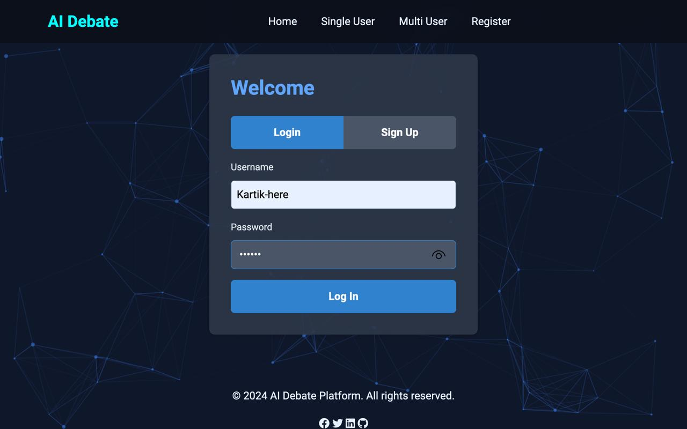
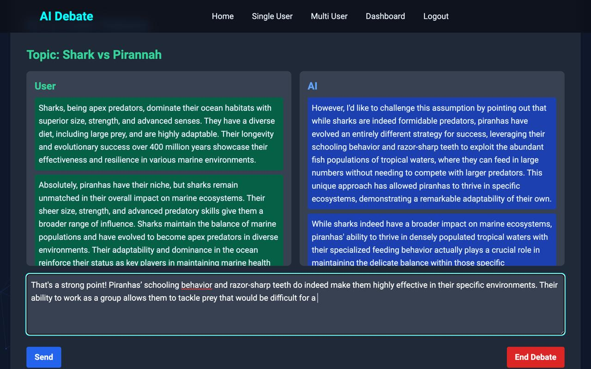
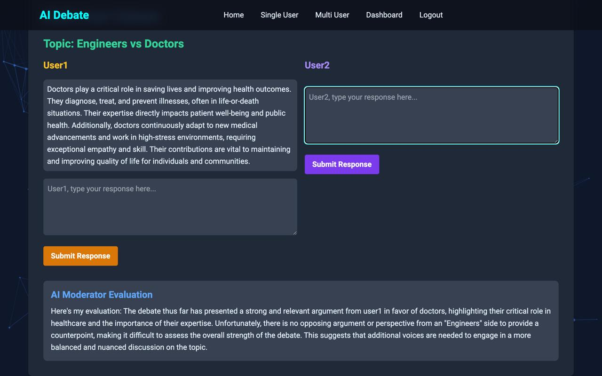
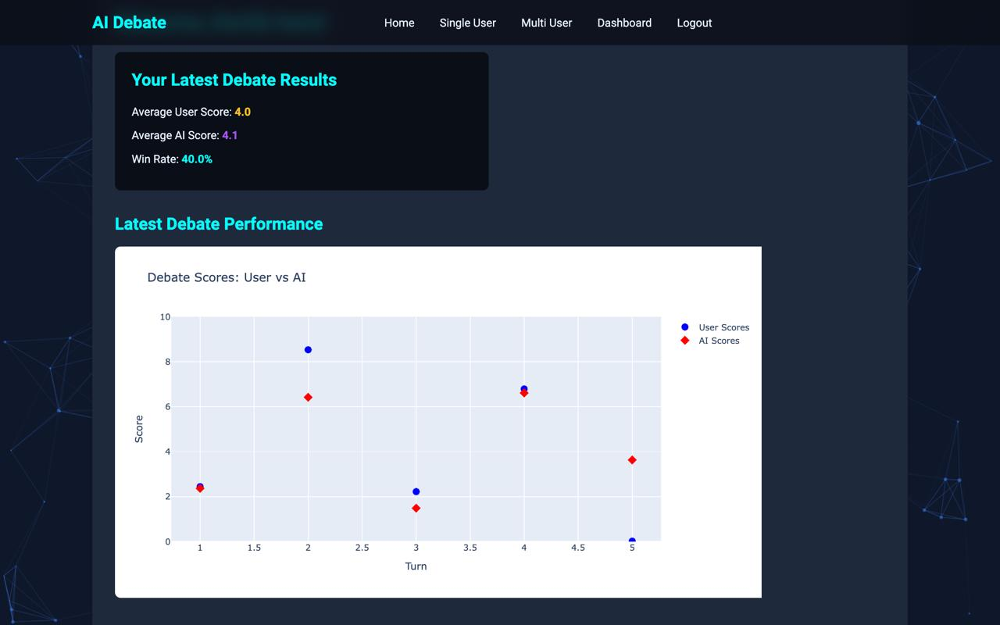

---
#Team Monday
-- kartikey Sapkal
-- Nachiket Kulkarni

# Online Debate App
### Always check for updated branch or use Default branch

## Overview

Debate App is a web application built using Flask that allows users to engage in debates with an AI. Users can register, log in, start debates, and view their performance metrics over time. The application also supports saving and visualizing debate scores using Plotly.

## Features

- **User Registration and Authentication**: Users can sign up, log in, and manage their accounts.
- **Debate System**: Engage in debates with AI, track debate history, and receive AI responses.
- **Visualization**: Plotly-based visualization of debate scores.
- **Database Integration**: PostgreSQL database for storing user data and debate scores.

## Technologies Used

- **Flask**: Web framework for building the application.
- **Langchain**: Library for natural language processing.
- **Plotly**: Library for creating interactive graphs.
- **PostgreSQL**: Relational database for data storage.
- **Docker**: Containerization platform to run the application in isolated environments.
- **Trivi**: Vulnerability scanning for docker containers.
- **html/css/js** : Providing overall user experience 

## Screenshots

### User Interface

|  |  |
|:----------------------------------:|:------------------------------------------:|
| Home Page                           | Register Page                              |

### Debate Experience

|  |  |
|:--------------------------------------:|:---------------------------------:|
| AI v/s user Page                            | MultiUser Page                           |

|  | 
#### Dashboard


## Setup Instructions

### Prerequisites

- Python 3.x
- PostgreSQL
- Docker (for containerized setup)

### Installation

1. **Clone the Repository**

   ```bash
   git clone https://github.com/yourusername/debate-app.git
   cd debate-app
   ```

2. **Set Up Environment Variables**

   Create a `.env` file in the root directory with the following environment variables:

   ```env
   SECRET_KEY=your_secret_key
   DB_USER=your_db_user
   DB_HOST=your_db_host
   DB_NAME=your_db_name
   DB_PASSWORD=your_db_password
   DB_PORT=your_db_port
   ```

3. **Install Dependencies**

   It is recommended to use a virtual environment. Install the required Python packages:

   ```bash
   pip install -r requirements.txt
   ```

4. **Initialize the Database**

   Run the application to initialize the database:

   ```bash
   python app.py
   ```

   This will create the necessary tables and columns in your PostgreSQL database.

5. **Run the Application**

   Start the Flask development server:

   ```bash
   python app.py
   ```

   The application will be available at `http://127.0.0.1:5000`.

### Docker Setup

If you prefer to run the application using Docker, follow these steps:

1. **Create a Dockerfile**

   Your `Dockerfile` should look like this:

   ```Dockerfile
   # Use Python 3.9 slim image
   FROM python:3.9-slim

   # Set the working directory
   WORKDIR /app

   # Copy requirements and install Python dependencies
   COPY requirements.txt .
   RUN pip install --no-cache-dir -r requirements.txt --verbose

   # Copy application code
   COPY static /app/static/
   COPY templates /app/templates/
   COPY app.py /app/

   # Create upload directory
   RUN mkdir -p /app/uploads

   # Copy environment variables
   COPY .env /app/.env

   # Expose port
   EXPOSE 5000

   # Command to run the Flask app
   CMD ["python", "app.py"]
   ```

2. **Create a Docker Compose File**

   Your `docker-compose.yml` file should look like this:

   ```yaml
   version: "3.8"

   services:
     web:
       build:
         context: .
         dockerfile: Dockerfile
       ports:
         - "5000:5000"
       volumes:
         - .:/app
       environment:
         - DB_USER=docker
         - DB_PASSWORD=docker
         - DB_NAME=docker
         - DB_HOST=docker
         - DB_PORT=5432
         - SECRET_KEY=your_secret_key # Set your secret key
       networks:
         - app-network
       depends_on:
         - ollama-service
         - postgres

     ollama-service:
       image: ollama/ollama:latest
       container_name: ollama-service
       ports:
         - "11434:11434"
       volumes:
         - ollama:/root/.ollama
       networks:
         - app-network

     postgres:
       image: postgres:13
       container_name: postgres
       environment:
         POSTGRES_USER: docker
         POSTGRES_PASSWORD: docker
         POSTGRES_DB: docker
       ports:
         - "5432:5432"
       networks:
         - app-network

   networks:
     app-network:
       driver: bridge

   volumes:
     ollama:
       driver: local
   ```

3. **Build and Run the Docker Containers**

   - Build the Docker image and start the containers:

     ```bash
     docker-compose up --build
     ```

   - The application will be available at `http://localhost:5000`.

## Troubleshooting

- **Database Connection Issues**: Ensure that your PostgreSQL database is running and the environment variables are correctly set in both `.env` and `docker-compose.yml`.
- **File Not Found Errors**: Verify that the file paths and names in the `Dockerfile` and application code are correct.
- **Dependencies Installation**: If you encounter issues with package installation, ensure all build dependencies are installed. For Alpine-based images, you may need to add `build-base`, `swig`, and `cmake` (commented out in the Dockerfile).

## Usage

1. **Access the Application**

   Navigate to `http://127.0.0.1:5000` in your web browser.

2. **Register and Log In**

   Use the `/register` endpoint to create a new account and `/login` to authenticate.

3. **Start a Debate**

   Go to `/single_user` to start a new debate. You can then use `/debate` to interact with the AI and `/end_debate` to finish and save the debate scores.

4. **View Dashboard**

   Access `/dashboard` to see your debate scores and performance metrics.


## Contributing

Feel free to fork the repository and submit pull requests. For major changes, please open an issue to discuss the proposed changes.

## License

This project is licensed under the MIT License. See the [LICENSE](LICENSE) file for details.

---

Make sure to replace the image file names and paths with those that match your actual images and structure. You can place your images in a folder named `images` in the root of your repository.
